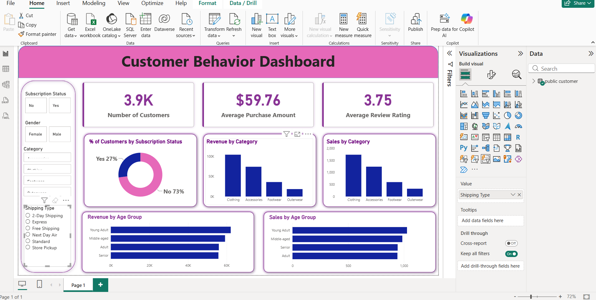

# 📊 Customer Sales Analytics Dashboard

An end-to-end data analytics project that analyzes customer shopping behavior using transactional data from **3,900 purchases**, uncovering insights into spending patterns, customer segments, product preferences, and subscription behavior — with a live interactive dashboard.

**🔗 Live App:** [customer-sales-analytics.onrender.com](https://customer-sales-analytics.onrender.com/)

---

## 📌 Project Overview

Retail businesses often struggle to translate raw transaction data into actionable strategy. This project simulates a real-world data analyst workflow to answer:

> **"How can a company leverage consumer shopping data to identify trends, improve customer engagement, and optimize marketing and product strategies?"**

The workflow covers the full analytics pipeline — from raw data to a stakeholder-facing dashboard:

- ✅ **Data Cleaning & Feature Engineering** (Python / Pandas)
- ✅ **Business Analysis** (SQL — PostgreSQL)
- ✅ **Visualization & Insights** (Power BI + Streamlit)
- ✅ **Reporting** — findings and business recommendations

---

## 🗂 Dataset

| | |
|---|---|
| Rows | 3,900 |
| Columns | 18 |
| Key fields | Age, Gender, Location, Category, Purchase Amount, Season, Discount Applied, Review Rating, Subscription Status, Shipping Type, Previous Purchases |

**Cleaning steps:** imputed 37 missing `review_rating` values using category-wise median, standardized columns to snake_case, engineered `age_group` and `purchase_frequency_days`, removed the redundant `promo_code_used` column, and loaded the cleaned dataset into PostgreSQL.

---

## 🛠 Tech Stack

`Python` · `Pandas` · `PostgreSQL` · `SQL` · `Power BI` · `Streamlit` · `Plotly`

---

## 🔍 Key Business Questions Answered (SQL)

- Revenue split by gender, age group, and subscription status
- Customers who used discounts but still spent above average
- Top 5 products by average review rating
- Standard vs. Express shipping — spend comparison
- Customer segmentation: New / Returning / Loyal (by purchase history)
- Top 3 products per category
- Are repeat buyers (5+ purchases) more likely to subscribe?

Full queries: [`customer_behavior_sql_queries.sql`](./customer_behavior_sql_queries.sql)

---

## 📈 Dashboard

Interactive Power BI dashboard covering subscription mix, revenue by category, revenue by age group, and shipping/discount trends.



*(Streamlit web app link above for the live interactive version.)*

---

## 💡 Key Insights & Recommendations

- **73% of customers are non-subscribers** — biggest single lever for revenue growth is converting this segment.
- **Loyal customers (3,116 of 3,900)** dominate the base — retention programs matter more than acquisition here.
- Discount-heavy categories (Hats, Sneakers, Coats — ~48-50% discount rate) may be **eroding margin without lifting loyalty** — worth a pricing review.
- Express shipping customers spend marginally more (**$60.48 vs $58.46**) — a signal for testing premium shipping bundles.
- Young Adults contribute the highest revenue by age group (**$62,143**) — a natural segment for targeted campaigns.

---

## 🚀 How to Run Locally

```bash
git clone https://github.com/snehasharma620/Customer_sales_analytics.git
cd Customer_sales_analytics
pip install -r requirements.txt
streamlit run app.py
```

---

## 📁 Project Structure

```
├── app.py                                     # Streamlit entry point
├── pages/                                      # Dashboard pages (Sales, Customer Insights, Payments)
├── customer_behavior_sql_queries.sql           # Business-question SQL queries
├── Customer_Shopping_Behavior_Analysis.ipynb   # Data cleaning + EDA
├── customer_behavior_dashboard.pbix            # Power BI dashboard
├── Customer_Shopping_Behavior_Analysis.pdf     # Full analysis report
├── requirements.txt
└── README.md
```

---

## 👩‍💻 About

Built by **Sneha Sharma** — B.Tech, Electronics & Communication Engineering, BIT Mesra (Patna Campus). Exploring Data Analytics, AI/ML, and backend engineering.

🔗 [GitHub](https://github.com/snehasharma620)

---

## 📜 License

MIT
